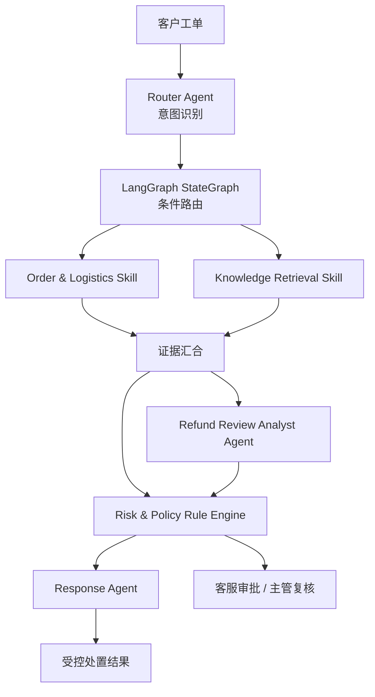

# ResolveFlow｜电商客服 AI 受控处置平台

ResolveFlow 是面向物流查询、延迟补偿和退款争议的多 Agent 售后工单平台。系统以 LangGraph 编排模型与工具，通过 RAG 提供规则证据，并用确定性风控、人工审批和审计机制限制 AI 的业务权限。

## 技术亮点

- **LangGraph 工作流**：使用 `StateGraph`、条件边和 fan-out/fan-in 按意图裁剪路径，在 MySQL 环境中并行执行订单核验与知识检索。
- **DeepSeek 与可靠降级**：模型负责意图理解、争议归纳和受控回复；结构化输出异常或模型不可用时降级到本地规则和模板。
- **可评测 RAG**：使用 `BAAI/bge-small-zh-v1.5 + Chroma` 检索版本化规则，支持证据引用、阈值过滤和无答案拒答。
- **安全与工程闭环**：Rule Engine 掌握退款和赔付门禁，结合 RBAC、人工审批、持久化队列、失败重试及全链路执行轨迹。

## 技术栈

`FastAPI` · `LangGraph` · `DeepSeek` · `SQLAlchemy` · `MySQL` · `Chroma` · `Vue 3` · `TypeScript` · `Docker Compose`

## 架构



LangGraph 负责单次工单的节点、条件路由和并行汇合；MySQL 持久化任务、审批与审计状态。模型不能绕过 Rule Engine 直接执行退款、赔付等高风险动作。

## 核心流程

| 场景 | 执行路径 | 结果 |
| --- | --- | --- |
| 物流查询 | 订单物流 Skill → 风控 → Response Agent | 自动回复物流事实 |
| 延迟补偿 | 订单物流与知识检索并行 → 风控 → Response Agent | 生成补偿建议，等待客服确认 |
| 退款与质量争议 | 订单物流与知识检索并行 → 退款分析 → 风控 → Response Agent | 禁止自动退款，转主管复核 |
| 未覆盖意图 | 风控 → Response Agent | 转人工兜底 |

客服只能确认规则授权范围内的小额优惠券；主管处理退款、质量争议和超额补偿；管理员负责全量工单、知识库、执行监控和评测。

## RAG 检索

知识文档清洗后按 240 字切块、保留 40 字重叠，由 BGE 生成归一化向量并写入 Chroma。查询经过可审计的业务同义词扩展后执行余弦检索，先宽召回候选，再按 `0.58` 阈值、文档分类和活动索引版本过滤，最终返回 Top 3 规则片段。

MySQL 是知识元数据的权威来源，Chroma 是可重建的向量索引。新 collection 完整构建后才切换活动指针；检索不可用或补偿规则证据缺失时，系统不会让模型自行补全依据，而是转人工处理。

## 验证结果

| 验证项 | 结果 | 口径 |
| --- | --- | --- |
| 后端回归 | **38/38 passed** | 覆盖 LangGraph 拓扑、队列恢复、权限、模型降级和风险门禁 |
| 前端回归 | **2/2 passed，生产构建成功** | 覆盖会话状态与补偿审批闭环 |
| DeepSeek Router | **Accuracy 0.9444、Macro-F1 0.9365** | 18 条金标，17/18 命中，全部由 DeepSeek 返回 |
| 高风险意图 | **Recall 1.0000** | 6 条退款风险样本全部命中 |
| RAG 检索 | **Recall@1 0.7143、Recall@3 0.9286、MRR 0.8214** | 14 条正例，BGE + Chroma 真实检索 |
| 无答案拒答 | **3/3** | 无匹配规则时不返回伪证据 |
| 越权动作门禁 | **8/8 拦截** | 非白名单模型动作全部转人工 |

DeepSeek Router 的唯一错例是将“我想修改收货地址”由 `other` 预测为 `logistics_query`。以上均为项目内受控金标集结果，不代表生产数据上的泛化性能。

## 快速开始

```powershell
Copy-Item .env.example .env
docker compose up --build
```

- Web UI：<http://localhost:5173>
- OpenAPI：<http://localhost:8000/docs>
- 健康检查：<http://localhost:8000/api/health>
- 演示订单：`RF202608290001`

Compose 会启动前端、API、MySQL 和 Chroma，执行数据库迁移并初始化演示数据。模型权重首次加载后会缓存在 Docker volume 中。

<details>
<summary>模型与认证配置</summary>

```ini
AI_PROVIDER=deepseek
DEEPSEEK_API_KEY=your-key
DEEPSEEK_MODEL=deepseek-v4-flash

AUTH_ENABLED=true
AUTH_SECRET=replace-with-a-random-secret
AUTH_ADMIN_PASSWORD=replace-with-a-strong-password
AUTH_SUPERVISOR_PASSWORD=replace-with-a-strong-password
AUTH_AGENT_PASSWORD=replace-with-a-strong-password
```

认证开启后，通过 `POST /api/auth/login` 获取 Bearer Token。知识库、执行监控和评测接口仅允许管理员访问。

</details>

<details>
<summary>本地开发与测试</summary>

后端：

```powershell
Set-Location backend
python -m venv .venv
.\.venv\Scripts\Activate.ps1
pip install -r requirements.txt
alembic upgrade head
uvicorn app.main:app --reload
pytest -q
```

前端：

```powershell
Set-Location frontend
npm ci
npm run dev
npm test
npm run build
```

CI 会在 Push 和 Pull Request 中运行后端测试、前端单测和生产构建。

</details>

## 当前边界

- 订单、支付、优惠券和退款使用演示数据或模拟动作，尚未接入真实业务系统。
- 后台 worker 当前与 API 进程共用；横向扩展时应拆分为独立 worker。
- RAG 尚未加入 BM25 混合检索和 reranker，生产环境需要使用持续扩充的脱敏工单集重新评测与校准阈值。
