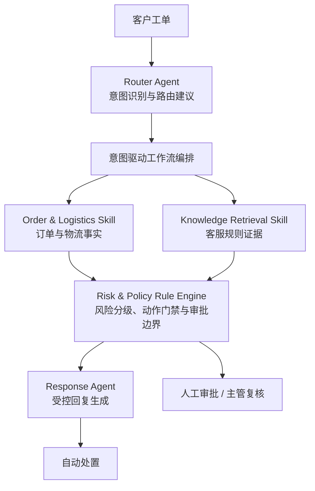
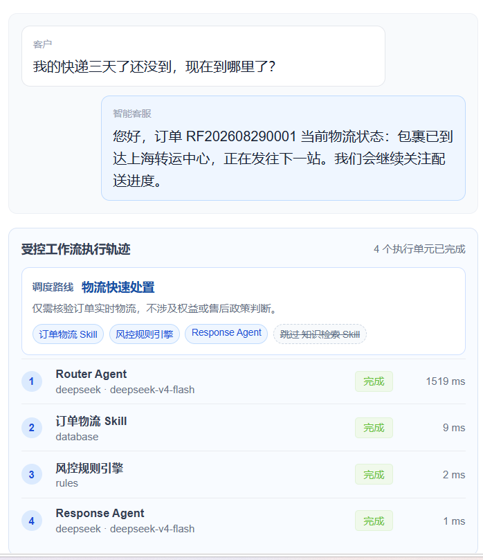
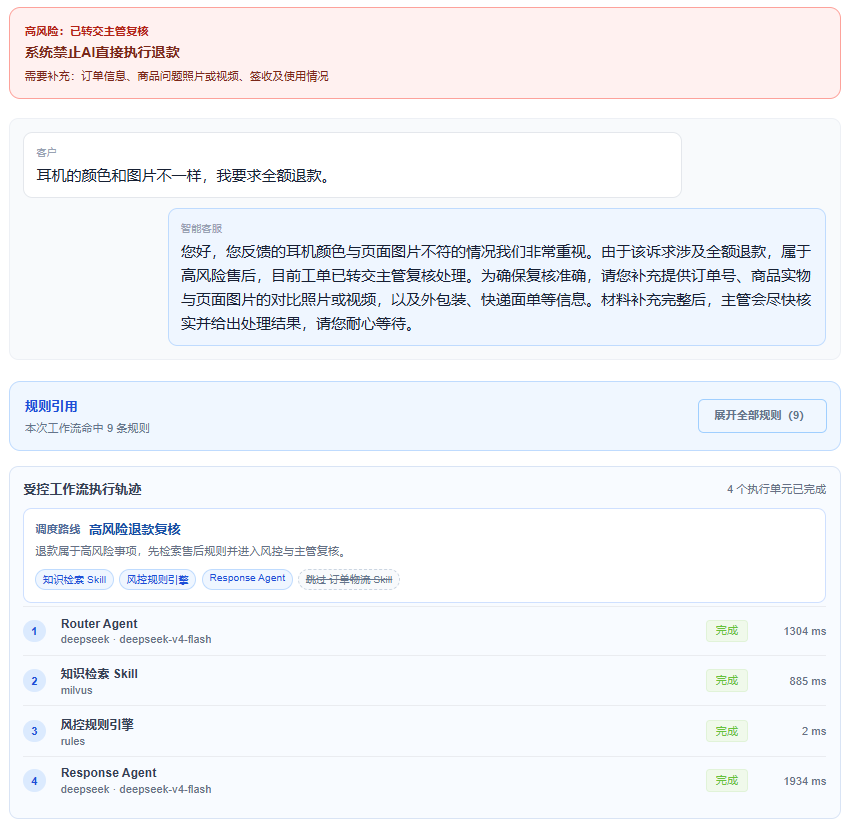

# ResolveFlow-电商客服 AI 受控处置平台

ResolveFlow 是一个面向电商客服场景的受控多 Agent 工单处置平台。系统将模型理解与生成能力、确定性业务查询、高风险规则决策和工作流编排解耦，使工单能够在自动化处理与人工审批之间安全流转。

## 架构

系统采用 **Agent + Skill + Rule Engine + Workflow Engine** 架构。只有需要模型理解或生成的单元被定义为 Agent；查询类能力以 Skill 形式提供；资金、赔付和审批边界始终由确定性规则控制。



在 MySQL 运行环境中，订单与知识检索可由工作流并行扇出，并在 Rule Engine 汇合；模型不能绕过规则直接执行退款、赔付等高风险动作。检索已启用但本轮未取得补偿规则证据时，系统不生成补偿建议，直接转人工。

### 工单处置与执行轨迹

下图展示一条物流工单的实际处理结果：Router Agent 选择快速路径，订单物流 Skill 查询确定性事实，Rule Engine 完成动作门禁，Response Agent 在受控上下文中生成回复；未参与本次路线的知识检索 Skill 会明确记录跳过原因。



### 高风险售后拦截与人工复核

当工单涉及质量争议或退款时，Risk & Policy Rule Engine 会禁止自动退款，要求补充证据并转交主管复核。规则引用和执行轨迹保留在工单中，便于人工继续处理和审计。



| 类型 | 模块 | 职责 |
| --- | --- | --- |
| Agent | Router Agent | 识别工单意图，并选择工作流路线；不拥有最终风控决策权 |
| Workflow Engine | 意图驱动工作流编排 | 按意图裁剪串行/并行路径，记录执行轨迹，并驱动任务恢复 |
| Skill | Order & Logistics Skill | 查询订单、物流等确定性事实 |
| Skill | Knowledge Retrieval Skill | 返回与工单相关的规则证据 |
| Rule Engine | Risk & Policy Rule Engine | 风险分级、退款拦截、补偿及审批边界 |
| Agent | Response Agent | 基于事实、规则和风控结论生成客户回复 |

### 工作流路线

- **物流查询**：订单物流 Skill → 风控规则 → Response Agent
- **延迟补偿**：订单物流 Skill 与知识检索 Skill 并行 → 风控规则 → 审批任务 → Response Agent
- **退款与质量争议**：知识检索 Skill → 风控规则 → 主管复核 → Response Agent
- **未覆盖意图**：风控规则 → 人工兜底

退款、赔付等高风险动作不由模型直接执行。模型仅参与意图理解和受控文本生成；Rule Engine 负责最终动作门禁。

## 后端工程能力

- **持久化工作队列**：工单创建后进入 `queued` 状态，由后台 worker 领取执行；失败任务可重试，应用启动时会恢复未完成任务。
- **意图驱动工作流编排**：根据 Router Agent 的输出选择最小执行路径；在 MySQL 运行环境中，需要多源证据时并行执行，并在风控节点汇合。
- **可观测执行轨迹**：每个执行单元记录输入、输出、状态、耗时、模型或工具来源、跳过原因及错误信息。
- **风险与审批闭环**：优惠券补偿仅在订单事实完整、且启用检索时取得本轮规则证据后进入审批队列；退款和质量争议进入主管待处理队列，禁止自动退款。
- **数据一致性与迁移**：使用 SQLAlchemy、Alembic 和 MySQL 管理订单、工单、审批、审计、任务及知识文档元数据。
- **权限与审计**：支持客服、主管、管理员角色；知识库写操作与审批操作受角色约束，审批记录写入实际操作账号。
- **模型降级**：统一 OpenAI 兼容模型适配层支持 DeepSeek、Qwen、OpenAI；模型不可用时分类和回复可降级到本地规则或模板。

## 数据与知识检索

MySQL 是业务数据和知识文档元数据的权威来源；Chroma 仅作为可重建的向量检索索引。知识检索 Skill 返回规则证据，为 Response Agent 提供上下文，但不会改变 Risk & Policy Rule Engine 的决策边界。

知识索引采用版本化 collection：新索引构建完成后才切换活动指针，构建失败时旧索引继续提供检索服务。系统提供小规模金标集的检索评测，用于观察规则语料和检索策略的变化。

当前 Compose 种子语料提供正例与无答案用例的可重复 RAG 评测；检索运行会记录 Recall@1、Recall@3、MRR、低置信正例数和无答案正确拒答数。扩展金标集的 Chroma 结果应以最新一次 Compose 运行记录为准，不应外推为生产场景泛化性能。

## 技术栈

- 后端：FastAPI、SQLAlchemy 2、Pydantic、Alembic、pytest
- 数据：MySQL 8、Chroma
- 前端：Vue 3、TypeScript、Element Plus、Vitest
- 基础设施：Docker Compose、GitHub Actions

## 快速开始

### Docker Compose

在项目根目录执行：

```powershell
docker compose up --build
```

服务地址：

- Web UI：<http://localhost:5173>
- OpenAPI：<http://localhost:8000/docs>
- API 健康检查：<http://localhost:8000/api/health>

Compose 会执行数据库迁移并初始化本地种子数据。可使用订单号 `RF202608290001` 创建工单。

### 本地开发

后端依赖 MySQL 与 Chroma；建议先通过 Compose 启动这些依赖服务，再启动应用。

```powershell
Copy-Item .env.example .env
Set-Location backend
python -m venv .venv
.\.venv\Scripts\Activate.ps1
pip install -r requirements.txt
alembic upgrade head
uvicorn app.main:app --reload
```

另开终端启动前端：

```powershell
Set-Location frontend
npm ci
npm run dev
```

## 配置

复制 `.env.example` 为 `.env` 后按需配置模型和认证。

```ini
AI_PROVIDER=deepseek
DEEPSEEK_API_KEY=your-key
DEEPSEEK_MODEL=deepseek-v4-flash
```

在共享环境中启用运营端认证：

```ini
AUTH_ENABLED=true
AUTH_SECRET=replace-with-a-random-secret
AUTH_ADMIN_PASSWORD=replace-with-a-strong-password
AUTH_SUPERVISOR_PASSWORD=replace-with-a-strong-password
AUTH_AGENT_PASSWORD=replace-with-a-strong-password
```

认证开启后，通过 `POST /api/auth/login` 获取 Bearer Token。知识库写操作仅允许管理员，审批仅允许主管或管理员。

## API 使用示例

创建工单后，接口会返回 `queued` 状态；后台 worker 会继续执行工作流。可通过工单详情接口查询最新状态和执行轨迹。

```powershell
$ticket = Invoke-RestMethod `
  -Method Post `
  -Uri http://localhost:8000/api/tickets `
  -ContentType 'application/json' `
  -Body '{"order_no":"RF202608290001","content":"我的快递三天了还没到，现在到哪里了？"}'

Invoke-RestMethod -Uri "http://localhost:8000/api/tickets/$($ticket.id)"
```

## 测试与构建

后端测试使用内存 SQLite，不依赖本地 MySQL：

```powershell
Set-Location backend
pytest -q
```

前端测试与生产构建：

```powershell
Set-Location frontend
npm test
npm run build
```

CI 在每次推送和 Pull Request 中以干净的 Python 3.12 与 Node 22 环境安装依赖，运行后端测试、前端单测和生产构建。

后端测试覆盖物流快速路径、补偿审批、退款转主管、队列失败重试与启动恢复、角色审批边界、模型超时/非法 JSON 降级，以及 8 类非白名单模型动作的规则拦截。测试默认使用离线规则和 SQLite；Chroma 检索指标需在 Compose 环境完成索引构建后单独运行，避免将 mock 结果作为检索指标。

## 验证结果与指标

以下结果均已在本地实际执行；离线单测与 Compose 集成评测分别记录，避免把 mock 结果混入检索指标。

| 验证项 | 方法 | 结果 | 说明 |
| --- | --- | --- | --- |
| 后端回归 | pytest 离线测试 | **32/32 passed** | 覆盖工单主流程、权限、队列、模型降级和检索边界 |
| 前端回归 | Vitest + 生产构建 | **1/1 passed，build 成功** | API 会话逻辑单测与 Vue 生产构建 |
| 高风险动作门禁 | 构造 8 类非白名单模型动作 | **8/8 拦截** | 全部转人工，未触发自动退款、赔付或其他业务动作 |
| 审批权限 | 客服与主管调用同一优惠券审批接口 | **客服拒绝、主管通过** | 普通客服无资金权益审批权限 |
| 任务可靠性 | 注入一次执行失败、模拟一次 `running` 任务重启 | **重试恢复、启动恢复均通过** | 校验尝试次数、最终状态和持久化任务状态 |
| 模型降级 | 注入超时、非法 JSON | **2/2 降级到规则分类** | 模型不可用时不阻塞工单安全处理 |
| 真实检索评测 | Compose + MySQL + Chroma；扩展金标集 | 待首次 Chroma 索引构建后运行 | 记录 Recall@1、Recall@3、MRR、低置信与无答案正确拒答数；每条 query 最多返回 3 个 chunk |

### 检索评测口径

- 正例金标 query 指定一个目标知识文档；目标文档出现在真实 Chroma 返回的前 1 或前 3 个 chunk 中分别计入 Recall@1、Recall@3。`MRR` 使用目标文档首次出现的倒数排名平均值。
- 无答案用例不指定目标文档；未返回规则证据计为正确拒答。低置信仅统计正例，定义为无结果或 Top-1 分数低于 `0.25`。
- `GET /api/evaluations/router` 可运行 18 条 Router 金标，返回 Accuracy、Macro-F1、混淆矩阵和退款风险意图 Recall。该集合是受控回归基线，生产评估仍需使用持续扩充的脱敏工单集。
- 重建索引时先写入并加载新 collection，再切换活动索引指针，避免“重建完成但查询暂不可见”导致评测失真。

## 当前边界

- 订单、支付、优惠券和退款仍使用本地示例数据或模拟动作，尚未对接外部业务系统。
- 当前后台 worker 与 API 进程共用；横向扩展时可替换为独立队列 worker。
- 知识检索目前使用本地中文 n-gram 向量化，适合作为轻量基线；生产场景可接入专用 embedding 与 reranker。
