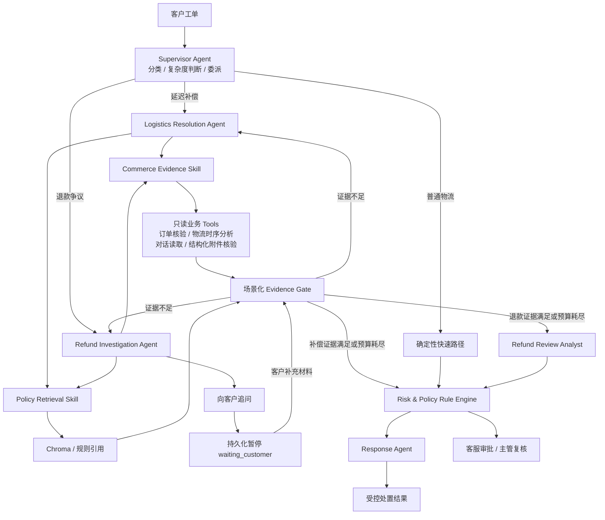

# ResolveFlow｜电商客服 AI 受控处置平台

ResolveFlow 是面向物流查询、延迟补偿和退款争议的多 Agent 售后工单平台。系统以 LangGraph 编排模型与工具，通过 RAG 提供规则证据，并用确定性风控、人工审批和审计机制限制 AI 的业务权限。

> **架构改造状态（进行中）**：项目正在从 FastAPI 单体迁移为“Spring Boot 业务核心 + FastAPI AI 服务”。
> 第二阶段已将 Vue 默认入口切换到 `business-service`：业务工单、客户补证、审批、JWT/RBAC、
> 状态机、AI任务和业务审计由 Java 持有；Python 只接收不可变案件快照，并通过受内部 Token 保护的
> 接口提供知识库和 AI 执行轨迹。Docker 生产形态默认关闭原 FastAPI 业务接口，并将 AI 数据写入
> 独立的 `resolveflow_ai` 数据库；旧接口只在本地兼容测试模式保留。

## 技术亮点

- **Supervisor–Specialist 多 Agent**：Supervisor 在快速路径和自主调查间路由；物流解决与退款调查 Agent 根据 Evidence Gate 反馈自主选择 Skill、补齐证据，并支持跨轮恢复。
- **两类共享 Skill**：Commerce Evidence Skill 不只查询字段，还会重建物流时间线、计算 SLA 超时/停滞并识别状态冲突，同时按哈希、格式和订单关联核验客户附件；Policy Retrieval Skill 按场景检索并返回可引用的政策依据。
- **DeepSeek 与可靠降级**：模型负责意图理解、争议归纳和受控回复；结构化输出异常或模型不可用时降级到本地规则和模板。
- **可评测 RAG**：使用 `BAAI/bge-small-zh-v1.5 + Chroma` 检索版本化规则，支持证据引用、阈值过滤和无答案拒答。
- **安全与工程闭环**：Rule Engine 掌握退款和赔付门禁，结合 RBAC、人工审批、数据库权威任务队列、指数退避、执行租约及失败转人工。

## 技术栈

`Spring Boot` · `Spring Security` · `FastAPI` · `LangGraph` · `DeepSeek` · `MySQL` · `Redis` · `Chroma` · `Prometheus` · `Vue 3` · `TypeScript` · `Docker Compose`

## 架构



LangGraph 负责 Supervisor 委派、条件路由和两个受限 Specialist Agent 循环；MySQL 中的 `CaseAgentState` 保存跨客户轮次的目标、观察历史、Gate 结果与待回答问题。两个 Specialist 最多规划 10 步、最多执行 3 次规则检索，只能通过两个注册 Skill 使用五个白名单只读 Tool，或发起客户追问。物流 Tool 输出完整轨迹、停滞时长、超时时长、异常类型和可追溯节点；客户材料 Tool 只接受结构化附件记录，文本中的“已上传”声明不会被当作证据。Evidence Gate 只声明场景所缺证据，不替 Agent 指定下一步；模型仍不能绕过 Rule Engine 执行退款、赔付等高风险动作。

## 核心流程

| 场景 | 执行路径 | 结果 |
| --- | --- | --- |
| 物流查询 | 快速路径固定调用 Commerce Evidence Skill → 风控 → Response 节点 | 重建物流时间线并返回最新节点、异常类型与证据引用 |
| 延迟补偿 | Logistics Resolution Agent → 共享 Skill → Evidence Gate 循环 → 风控 | 只有 SLA 计算确认超时且轨迹无冲突，才生成补偿建议并等待客服确认 |
| 退款与质量争议 | Refund Investigation Agent → 共享 Skill → Evidence Gate → 必要时等待客户材料 → 退款分析 → 风控 | 核验附件格式、哈希去重和订单关联；禁止自动退款，证据准备后转主管复核 |
| 未覆盖意图 | 风控 → Response Agent | 转人工兜底 |

客服只能确认规则授权范围内的小额优惠券；主管处理退款、质量争议和超额补偿；管理员负责全量工单、知识库、执行监控和评测。

## RAG 检索

知识文档清洗后按 240 字切块、保留 40 字重叠，由 BGE 生成归一化向量并写入 Chroma。查询经过可审计的业务同义词扩展后执行余弦检索，先宽召回候选，再按 `0.58` 阈值、文档分类和活动索引版本过滤，最终返回 Top 3 规则片段。

MySQL 是知识元数据的权威来源，Chroma 是可重建的向量索引。新 collection 完整构建后才切换活动指针；检索不可用或补偿规则证据缺失时，系统不会让模型自行补全依据，而是转人工处理。

## 验证结果

| 验证项 | 结果 | 口径 |
| --- | --- | --- |
| 后端回归 | **Python 58/58、Java 17/17 passed** | 覆盖业务回归、AI 任务可靠性、请求追踪和 Prometheus 指标端点 |
| 前端回归 | **4/4 passed，生产构建成功** | 覆盖会话状态、受控审批流程和请求 ID 生成 |
| DeepSeek Router | **Accuracy 0.9444、Macro-F1 0.9365** | 18 条金标，17/18 命中，全部由 DeepSeek 返回 |
| 高风险意图 | **Recall 1.0000** | 6 条退款风险样本全部命中 |
| RAG 检索 | **Recall@1 0.7143、Recall@3 0.9286、MRR 0.8214** | 14 条正例，BGE + Chroma 真实检索 |
| 无答案拒答 | **3/3** | 无匹配规则时不返回伪证据 |
| 越权动作门禁 | **8/8 拦截** | 非白名单模型动作全部转人工 |

DeepSeek Router 的唯一错例是将“我想修改收货地址”由 `other` 预测为 `logistics_query`。以上均为项目内受控金标集结果，不代表生产数据上的泛化性能。

## 快速开始

```powershell
Copy-Item .env.example .env
docker compose up --build
```

- Web UI：<http://localhost:5173>
- Java 业务健康检查：<http://localhost:8080/api/health>
- Python AI 内部 API 文档：<http://localhost:8000/docs>
- Python AI 健康检查：<http://localhost:8000/health>
- Prometheus：<http://localhost:9090>
- 演示订单：`RF202608290001`
- 演示账号：`admin / admin123456`、`supervisor / supervisor123456`、`agent / agent123456`

Compose 会启动前端、Java Business API、Python AI API、MySQL、Redis、Chroma 和 Prometheus，执行两端数据库迁移并初始化演示数据。模型权重首次加载后会缓存在 Docker volume 中。
一个 MySQL 容器中创建相互隔离的 `resolveflow_business` 与 `resolveflow_ai` 数据库；`db-init`
也会为已有 Docker 数据卷补建这两个数据库。详细边界见 [生产形态改造说明](docs/production-shaped-architecture.md)。

<details>
<summary>模型与认证配置</summary>

```ini
AI_PROVIDER=deepseek
DEEPSEEK_API_KEY=your-key
DEEPSEEK_MODEL=deepseek-v4-flash
CASE_MANAGER_LLM_PROVIDER=deepseek
SUPERVISOR_LLM_PROVIDER=deepseek
LOGISTICS_RESOLUTION_LLM_PROVIDER=deepseek
REFUND_INVESTIGATION_LLM_PROVIDER=deepseek

AUTH_ENABLED=true
AUTH_SECRET=replace-with-a-random-secret
AUTH_ADMIN_PASSWORD=replace-with-a-strong-password
AUTH_SUPERVISOR_PASSWORD=replace-with-a-strong-password
AUTH_AGENT_PASSWORD=replace-with-a-strong-password
```

认证开启后，通过 `POST /api/auth/login` 获取 Bearer Token。知识库、执行监控和评测接口仅允许管理员访问。

</details>

<details>
<summary>本地开发与测试</summary>

后端：

```powershell
Set-Location backend
python -m venv .venv
.\.venv\Scripts\Activate.ps1
pip install -r requirements.txt
alembic upgrade head
uvicorn app.main:app --reload
pytest -q
```

前端：

```powershell
Set-Location frontend
npm ci
npm run dev
npm test
npm run build
```

CI 会在 Push 和 Pull Request 中运行后端测试、前端单测和生产构建。

</details>

## 当前边界

- 订单、支付、优惠券和退款使用演示数据或模拟动作，尚未接入真实业务系统。
- 客户附件当前保存并核验对象元数据（文件名、类型、存储地址和 SHA-256），演示页使用模拟存储地址；生产环境需接入对象存储、上传签名与内容安全扫描。
- 后台 worker 当前与 API 进程共用；横向扩展时应拆分为独立 worker。
- 跨轮状态由业务表持久化并重入 LangGraph，尚未接入 LangGraph 官方数据库 Checkpointer。
- Policy Retrieval 是两个 Specialist 共享的受限 Skill，并非具备独立目标和循环的 Policy Research Agent。
- RAG 在本项目中刻意保持轻量，只承担规则检索、阈值拒答和证据引用；复杂混合检索与 reranker 不属于本项目重点。
- 当前提供统一请求 ID、结构化日志字段和 Prometheus 指标，未引入 ELK、Grafana 或完整 OpenTelemetry Collector，以控制本地 Demo 复杂度。
