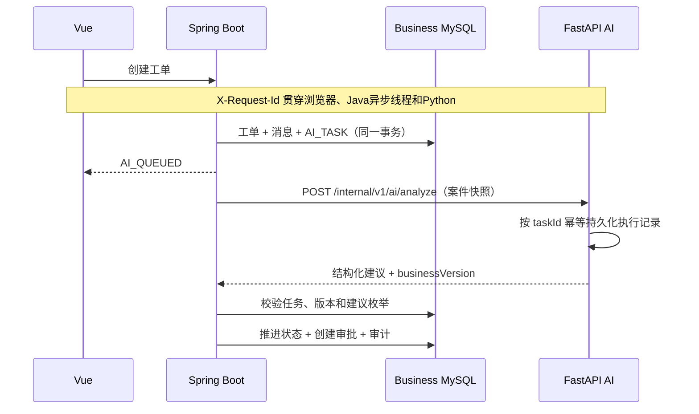

# ResolveFlow 生产形态改造

## 服务所有权

| 服务 | 权威数据 | 允许的动作 |
| --- | --- | --- |
| `business-api` | 用户、订单、物流、工单、审批、业务审计、AI任务摘要 | 校验权限、推进状态机、创建审批、执行模拟业务动作 |
| `ai-api` | AI分析运行、模型调用、知识元数据、向量索引 | 分析不可变案件快照并返回非约束性建议 |
| `frontend` | 无 | 只调用 `business-api`，由 Java 代理知识库和 Agent 轨迹 |

Java 和 Python 可以使用同一个 MySQL 容器，但必须使用不同数据库。禁止 Python 直接写入
`resolveflow_business`，禁止 Java 直接读取 AI 内部表。

## 当前业务时序

AI 任务不是只依赖进程内线程：创建工单的事务提交后会发送一次低延迟唤醒，同时数据库中的
`ai_tasks` 是权威任务队列。调度器周期扫描到期任务，因此进程在提交后崩溃也不会永久丢单。

## AI 任务可靠性

- Worker 领取任务时使用数据库悲观锁，并写入执行租约；重复事件或多个实例只能有一个成功领取。
- 临时网络错误、`429` 和服务端错误按 `2s → 4s → 30s 上限`进行指数退避，默认最多尝试 3 次。
- 参数错误、身份不匹配等永久错误不会盲目重试；重试耗尽后工单自动进入人工复核队列。
- 调度器会回收过期执行租约，恢复进程异常退出时遗留的 `RUNNING` 任务。
- Docker 环境使用 Redis 短租约协调多实例扫描；Redis 不可用时降级为数据库锁，任务正确性不依赖 Redis。
- 管理员可通过 `GET /api/ai-tasks` 查看尝试次数、下次执行时间、租约和最近错误。

## 安全不变量

1. AI 返回值是建议，不是业务命令。
2. Python 不持有业务数据库凭据。
3. 所有资金权益动作必须经过 Java 确定性规则和人工审批。
4. AI 结果中的 `taskId`、`ticketId` 和 `businessVersion` 必须与任务记录一致。
5. 旧版本结果不能覆盖更新后的工单。
6. Java 与 Python 的内部调用 Token 至少 32 位，启动脚本为本地环境生成随机 JWT、内部 Token 和账号密码。
7. Python 与 Nginx 容器以非 root 用户运行；所有对宿主机开放的端口只绑定 `127.0.0.1`。

## 本地端口

| 组件 | 端口 |
| --- | --- |
| Vue | `5173` |
| Java Business API | `8080` |
| Python AI API | `8000` |
| Chroma | 仅 Compose 内网 |
| MySQL | 仅 Compose 内网 |
| Redis | 仅 Compose 内网 |
| Prometheus | `9090` |

Vue 开发服务器把 `/api` 代理到 `localhost:8080`；Docker 中由 Nginx 把 `/api` 代理到
`business-api:8080`。浏览器不直接访问 Python。Docker 通过
`LEGACY_BUSINESS_API_ENABLED=false` 关闭 Python 原业务路由；兼容路由只在默认本地测试配置中启用，
便于迁移期间继续运行历史回归用例。

## 数据库与幂等

- `business-api` 只连接 `resolveflow_business`；Python 只连接 `resolveflow_ai`。
- `db-init` 在 MySQL 健康后幂等创建两个数据库，因此旧 `mysql_data` volume 不需要删除重建。
- Python 以 Java 生成的 `taskId` 作为唯一键保存分析输入、输出、耗时和失败信息。相同任务成功后重放
  会返回已保存结果，不会再次调用分析链路；并发中的相同任务返回 `409`。
- AI 执行记录不外键关联 Java 工单表，只保存快照中的 `ticketId` 和 `businessVersion`，避免跨服务数据库耦合。

## 可观测性

- Vue 为每次 API 请求生成安全的 `X-Request-Id`；Java 校验或生成该值，写入 MDC，并通过任务装饰器跨异步线程传播。
- Java 调用 Python 时继续传递同一个请求 ID，两个服务都把它返回到响应头并写入请求日志。
- Java 在 `/actuator/prometheus` 暴露任务领取、重试、转人工、租约恢复、执行结果和耗时指标。
- Python 在 `/metrics` 暴露 HTTP 请求量、延迟，以及分析完成、缓存命中、冲突和失败指标。
- Compose 中的 Prometheus 每 15 秒抓取两个服务并保留 7 天本地数据；指标标签只使用状态、路由等低基数字段，任务 ID 不进入标签。
