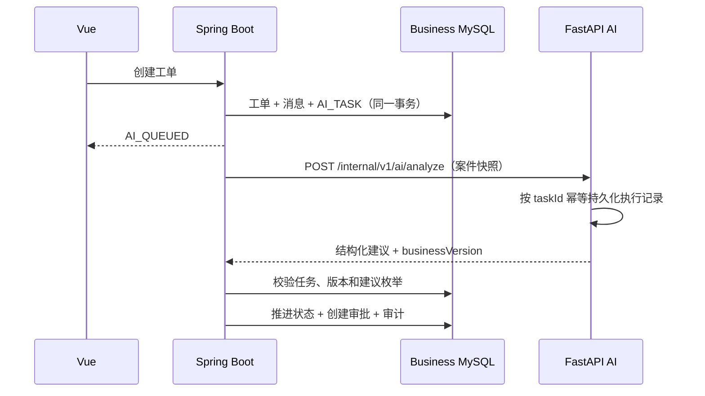

# ResolveFlow 生产形态改造

## 服务所有权

| 服务 | 权威数据 | 允许的动作 |
| --- | --- | --- |
| `business-api` | 用户、订单、物流、工单、审批、业务审计、AI任务摘要 | 校验权限、推进状态机、创建审批、执行模拟业务动作 |
| `api`（逐步更名为 `ai-api`） | AI分析运行、模型调用、知识元数据、向量索引 | 分析不可变案件快照并返回非约束性建议 |
| `frontend` | 无 | 只调用 `business-api`，由 Java 代理知识库和 Agent 轨迹 |

Java 和 Python 可以使用同一个 MySQL 容器，但必须使用不同数据库。禁止 Python 直接写入
`resolveflow_business`，禁止 Java 直接读取 AI 内部表。

## 当前业务时序

## 安全不变量

1. AI 返回值是建议，不是业务命令。
2. Python 不持有业务数据库凭据。
3. 所有资金权益动作必须经过 Java 确定性规则和人工审批。
4. AI 结果中的 `taskId`、`ticketId` 和 `businessVersion` 必须与任务记录一致。
5. 旧版本结果不能覆盖更新后的工单。

## 本地端口

| 组件 | 端口 |
| --- | --- |
| Vue | `5173` |
| Java Business API | `8080` |
| Python AI API | `8000` |
| Chroma | 仅 Compose 内网 |
| MySQL | 仅 Compose 内网 |
| Redis | 仅 Compose 内网 |

Vue 开发服务器把 `/api` 代理到 `localhost:8080`；Docker 中由 Nginx 把 `/api` 代理到
`business-api:8080`。浏览器不直接访问 Python。Docker 通过
`LEGACY_BUSINESS_API_ENABLED=false` 关闭 Python 原业务路由；兼容路由只在默认本地测试配置中启用，
便于迁移期间继续运行历史回归用例。

## 数据库与幂等

- `business-api` 只连接 `resolveflow_business`；Python 只连接 `resolveflow_ai`。
- `db-init` 在 MySQL 健康后幂等创建两个数据库，因此旧 `mysql_data` volume 不需要删除重建。
- Python 以 Java 生成的 `taskId` 作为唯一键保存分析输入、输出、耗时和失败信息。相同任务成功后重放
  会返回已保存结果，不会再次调用分析链路；并发中的相同任务返回 `409`。
- AI 执行记录不外键关联 Java 工单表，只保存快照中的 `ticketId` 和 `businessVersion`，避免跨服务数据库耦合。
